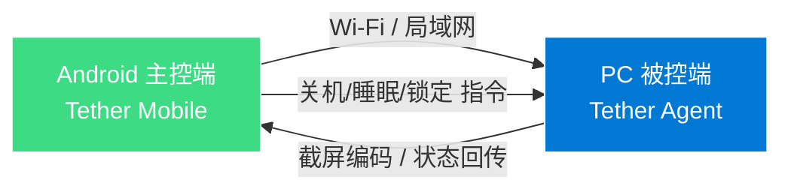

<div align="center">

# 🔗 Tether

### *Your PC, just a tap away.*

[](https://github.com/YunLv-L/Tether/actions)
[](LICENSE)
[](https://developer.android.com)
[](https://resend.com)

**Pure LAN speed. Zero latency. Total control.**

</div>

---

## 📖 简介

**Tether** 是一款专为**局域网**环境设计的 Android 远程控制工具。手机通过 Wi-Fi 连接电脑，实时传输画面，并执行关机、睡眠、锁定等快捷指令。**PC 端仅需运行一个轻量级被动 Agent（代理程序）**，无需公网 IP，无需云端中转，所有数据走内网，极速且安全。

---

## ✨ 核心功能

| 模块 | 说明 |
| :--- | :--- |
| 📱 **画面传输** | 实时截取 PC 屏幕，通过局域网推流至 Android 端显示（支持缩放/触控）。 |
| ⚡ **快捷指令** | 一键发送 **关机 (Shutdown)**、**睡眠 (Sleep)**、**锁定 (Lock)** 指令。 |
| 🔌 **即插即用** | 基于 mDNS / UDP 广播，手机端自动发现局域网内的 PC Agent。 |
| 🔒 **隐私安全** | 纯内网通信，数据不经过任何外部服务器，完全离线可用。 |

---

## 🏗️ 架构概览



---

## 📦 多架构支持 (Multi-Architecture)

得益于 GitHub Actions 的自动化构建，Tether 的 APK 原生支持以下四大 Android 主流 CPU 架构，确保在所有手机/平板上流畅运行：

| ABI | 说明 |
| :--- | :--- |
| `armeabi-v7a` | 兼容 32 位老旧 ARM 设备 |
| `arm64-v8a` | 主流 64 位 ARM 设备（推荐） |
| `x86` | 模拟器 / 部分平板 |
| `x86_64` | 高性能 x86 架构设备 |

---

## 🚀 快速开始 (Getting Started)

### 1. 获取 APK
前往本仓库的 **[Releases](https://github.com/YunLv-L/Tether/releases)** 页面下载最新版 APK，或通过 Actions 构建产物的 Artifacts 获取。

### 2. 运行 PC Agent
下载并运行 PC 端的 **Tether Agent**（服务程序）。Agent 启动后会常驻系统托盘，等待手机连接。
> *（注：PC 端代码正在开发中，敬请期待）*

### 3. 连接与控制
确保手机与电脑连接在**同一个局域网**下。打开手机 App，点击自动发现的设备，即可开始传输画面与控制。

---

## 🤖 自动化构建 (CI/CD)

本项目使用 **GitHub Actions** 实现全自动化构建与通知：

- **触发方式**：`git push` 到 `main` / `master` 分支，或推送 `v*` 标签。
- **构建流程**：云端自动拉取代码 → 注入签名 → 编译 4 种 ABI 架构的 APK → 上传 Artifact。
- **失败通知**：构建结果通过 **Resend API** 发送邮件至开发者邮箱，第一时间掌握构建状态。

```yaml
# 核心构建步骤（简化）
- name: Adapt ABI filters
  run: sed -i 's/abiFilters.*/abiFilters "armeabi-v7a", "arm64-v8a", "x86_64", "x86"/' app/build.gradle.kts
- name: Build Release APK
  run: ./gradlew assembleRelease
- name: Send Email via Resend
  if: always()
  run: curl -X POST https://api.resend.com/emails ...
```

---

## 🛠️ 技术栈 (Tech Stack)

- **Android 端**：Kotlin + Material Design 3 + Coroutines
- **网络通信**：WebSocket / UDP (局域网)
- **PC 端 (规划)**：C# / .NET (WPF) 或 Python (PyQt)
- **CI/CD**：GitHub Actions + Gradle (自定义 ABI 构建)
- **通知服务**：Resend API (邮件)

---

## 🗺️ 路线图 (Roadmap)

- [x] 项目初始化 & 多架构构建流水线
- [x] 邮件通知集成 (Resend)
- [ ] Android 端画面解码显示
- [ ] PC Agent 基础框架 (截屏 + Socket 服务)
- [ ] 触控反向控制 (鼠标/键盘输入)
- [ ] 高帧率编码优化 (H.264 硬件编码)

---

## 🤝 贡献指南

欢迎提交 Issue 和 Pull Request！请确保：

1. 代码风格符合 Kotlin 官方规范。
2. 提交前确保本地构建通过（或依赖 Actions 检测）。
3. 重大变更需在 Issue 中先讨论。

---

## 📄 许可证

本项目采用 **Apache License 2.0** 开源协议。你可以自由使用、修改、分发，但请保留版权声明。

```
Copyright 2026 YunLv-L

Licensed under the Apache License, Version 2.0 (the "License");
you may not use this file except in compliance with the License.
You may obtain a copy of the License at

    http://www.apache.org/licenses/LICENSE-2.0
```

---

<div align="center">

**Made with ❤️ by YunLv-L**

[Report Bug](https://github.com/YunLv-L/Tether/issues) · [Request Feature](https://github.com/YunLv-L/Tether/issues)

</div>